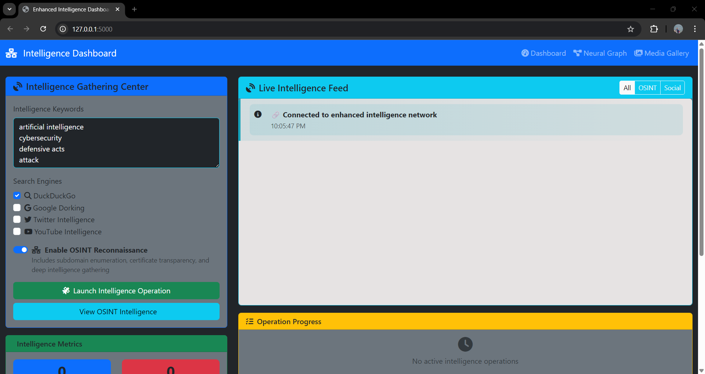
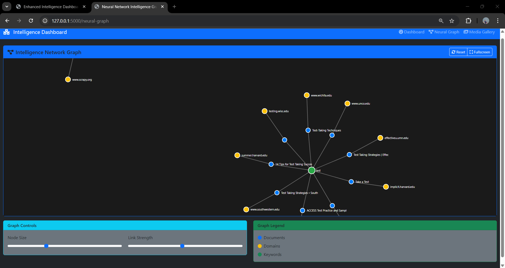
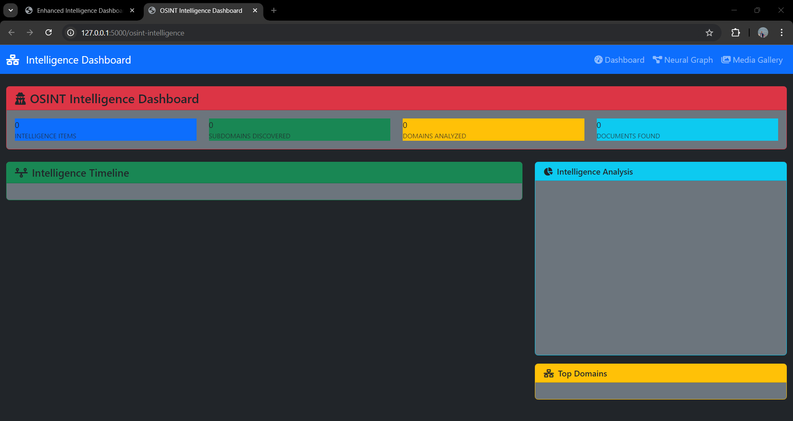
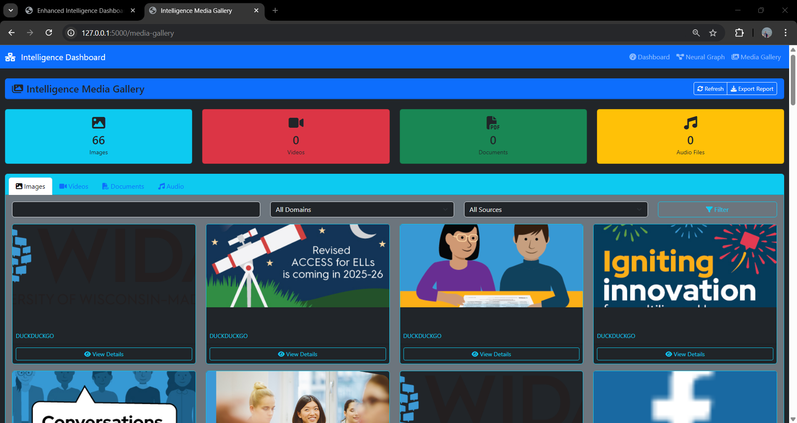

# Advanced OSINT & Multi-Engine Intelligence Dashboard

A powerful, modern intelligence-gathering and OSINT platform. Features multi-source web/data scraping, subdomain recon, social media intelligence, a real-time dashboard, neural network visualizations, and a responsive media gallery—all stored in MongoDB and orchestrated via an interactive Flask/SocketIO UI.

---

## Demo & Screenshots

| Main Dashboard | Neural Graph | OSINT Dashboard | Media Gallery |
|:--:|:--:|:--:|:--:|
|  |  |  |  |

- **Main Dashboard:** Launch/search intelligence tasks, live status feeds, progress bars, full statistics.
- **Neural Graph:** Interactive D3.js visual network of documents, domains, keywords, and OSINT relationships.
- **OSINT Dashboard:** Subdomain enumeration, timeline of findings, analytics for deep reconnaissance.
- **Media Gallery:** Filter and preview all collected images, videos, documents, and audio files.

---

## Features

- **Multi-source search:** DuckDuckGo, Google dorking (stealthy), Twitter, YouTube, and more.
- **OSINT Reconnaissance:** Automated subdomain discovery (CT logs, DNS, APIs, Wayback), tech/WAF/WHOIS info.
- **Real-time dashboard:** Web UI (Flask/SocketIO), live intelligence feed, phase/progress tracking.
- **Neural network graphs:** D3.js interactive visualization of intelligence relationships.
- **Media gallery:** Explore all images, videos, docs, and audio from all sources, filterable by domain/source.
- **MongoDB backend:** Unified, fast search/store for all intelligence types (no JSON exports by default).
- **Extensible:** Add more dorkers, OSINT engines, visualizations, and analytics.

---

## Quick Start

1. _Requirements_:
    - Python 3.9+
    - MongoDB running/configured (see .env/config/settings.py)
    - Chrome/Chromium (for Selenium/undetected-chromedriver)
    - Node.js (optional: for front-end build)
    - Recommended: Linux/macOS (Windows supported)

2. _Installation:_
    ```
    git clone https://github.com/your-org/your-repo.git
    cd your-repo

    python -m venv venv
    source venv/bin/activate

    pip install -r requirements.txt
    ```

3. _Configure your database connection:_
    Edit `.env` or `config/settings.py`:
    ```
    MONGODB_URL=mongodb://localhost:27017/
    DATABASE_NAME=osint_db
    ```

4. _Start the dashboard:_
    ```
    python web_dashboard.py
    ```
    Visit [http://127.0.0.1:5000/](http://127.0.0.1:5000/) in your browser.

5. _Optionally, run full-stack OSINT CLI:_
    ```
    python main_osint.py --target indiannavy.gov.in
    ```

---

---

## Supported Dashboards

- `/` : Main Dashboard
- `/media-gallery` : Media Gallery and filters
- `/neural-graph` : Neural network graph of all data
- `/osint-intelligence` : OSINT summary, timeline, charts

---

## FAQ & Troubleshooting

**MongoDB connection refused?**  
Make sure MongoDB is running, and MONGODB_URL is set.

**No media in gallery?**  
Check that scrapers found media during runs, and check MongoDB.

**Neural graph missing?**  
Ensure `/api/graph-data` and `/neural-graph` endpoints/templates are unmodified.

**Selenium headless issues?**  
Ensure local Chrome/Chromium is installed; consult undetected-chromedriver docs.

---

## Contributing

PRs are welcome for new scrapers, dorkers, OSINT recon methods, UI improvements, and bugfixes.  
See [CONTRIBUTING.md](CONTRIBUTING.md) for guidelines.

---

## License

Apache 2.0.  
© 2025 [Mohit Mohanty] 

---

## Credits

- Flask, PyMongo, D3.js, Chart.js, undetected-chromedriver, theHarvester, Sublist3r, and all OSINT/FOSS contributors.

---

_Ready for deployment. Intelligence, visualized._

**ProtonMine Team**


